# 🎓 Tests DAW - Plataforma de Evaluación Interactiva

[](https://www.typescriptlang.org/)
[](https://reactjs.org/)
[](https://nodejs.org/)
[](https://www.postgresql.org/)
[](https://vercel.com)

> Sistema completo de evaluación con doble modo (Práctica/Examen), estadísticas detalladas y gamificación mediante ranking.

**🌐 Demo en vivo:** [https://tests-daw.prodelaya.dev](https://tests-daw.prodelaya.dev)

---

## 📋 Tabla de Contenidos

- [Sobre el Proyecto](#-sobre-el-proyecto)
- [Características Clave](#-características-clave)
- [Arquitectura Backend](#-arquitectura-backend-agnóstica-al-lenguaje)
- [Stack Tecnológico](#️-stack-tecnológico)
- [Screenshots](#-screenshots)
- [Instalación Local](#-instalación-local)
- [Escalabilidad](#-escalabilidad-añadir-asignaturas)
- [Deploy](#-deploy-en-producción)
- [Roadmap](#-roadmap)
- [Contacto](#-contacto)

---

## 🎯 Sobre el Proyecto

Plataforma web fullstack para practicar tests de **Desarrollo de Aplicaciones Web (DAW)**. Diseñada con arquitectura profesional, patrones de diseño escalables y enfoque en backend robusto.

Actualmente contiene **211 preguntas** de **Desarrollo Web en Entorno Cliente (DWEC)**, con capacidad para expandirse a múltiples asignaturas mediante sistema de seed automático.

### 💼 Contexto Profesional

Este proyecto demuestra competencias **backend agnósticas al lenguaje**, aplicables a cualquier stack (Python, Node.js, Java, Go):
- Diseño de APIs RESTful semánticas
- Arquitectura MVC escalable
- Autenticación y seguridad (JWT, hashing)
- Diseño de base de datos relacional
- Optimización de queries (O(n) vs O(n²))
- Gestión de estado y caché
- Testing y validación de datos

**Objetivo profesional:** Backend Developer especializado en Python (Django/FastAPI). Este proyecto showcasea habilidades transferibles a cualquier tecnología backend.

---

## ✨ Características Clave

### 🎯 Sistema Dual de Testing

**Modo Práctica (Feedback Inmediato):**
- ✅ Respuesta correcta con fondo verde
- ❌ Respuesta incorrecta con fondo rojo
- 📖 Explicación visible al instante
- 🎓 Ideal para aprender

**Modo Examen (Sin Feedback):**
- 🔴 Sin colores ni pistas durante el test
- ✅ Todas las correcciones juntas al finalizar
- 📊 Simulación realista de evaluación

### 📊 Gestión Inteligente

- **Tests por Tema:** Practica UTs específicas (ej: UT1 "Introducción al Desarrollo Web")
- **Test Final:** Todas las preguntas del módulo mezcladas
- **Preguntas Falladas:** Repaso automático de errores previos
- **Selector Dinámico:** Elige 10, 20, 30... o MÁXIMO preguntas

### 📈 Estadísticas Detalladas

- Promedio de aciertos por asignatura/tema
- Total de intentos realizados
- Historial temporal de progreso
- Contador de preguntas pendientes

### 🏆 Gamificación

- **Ranking global** con podio visual (🥇 🥈 🥉)
- Títulos roast para top 3 ("Más Tests que Vida Social")
- Tabla de clasificación completa
- Motivación competitiva saludable

### 🎨 Experiencia de Usuario

- **Dark Mode completo** con toggle en todas las páginas
- Diseño **responsive mobile-first** (Tailwind CSS)
- Transiciones suaves entre estados
- Navegación intuitiva con React Router

---

## 🏗️ Arquitectura Backend (Agnóstica al Lenguaje)

### Patrones de Diseño Aplicados

```
┌─────────────────────────────────────────┐
│          CLIENTE (Navegador)            │
│         React SPA + Axios               │
└──────────────┬──────────────────────────┘
               │ HTTPS + JWT
               ▼
┌─────────────────────────────────────────┐
│        API REST (Express.js)            │
│                                         │
│  📁 Arquitectura MVC:                   │
│  ├── Routes (Endpoints)                 │
│  ├── Middlewares (Validación + Auth)   │
│  ├── Controllers (Lógica de negocio)   │
│  ├── Services (Comunicación DB)         │
│  └── Schemas (Validación de DTOs)      │
│                                         │
│  🔐 Seguridad:                          │
│  ├── JWT (Tokens de 24h)               │
│  ├── bcrypt (Hashing con 10 rounds)    │
│  ├── Zod (Validación de datos)         │
│  ├── CORS (Whitelist explícita)        │
│  └── Helmet (Headers HTTP seguros)     │
│                                         │
│  ⚡ Optimizaciones:                     │
│  ├── Map O(1) vs Array.find() O(n)     │
│  ├── Fisher-Yates shuffle O(n)         │
│  ├── Prisma groupBy (agregaciones SQL) │
│  └── skipDuplicates (PK compuesta)     │
└──────────────┬──────────────────────────┘
               │ Prisma ORM
               ▼
┌─────────────────────────────────────────┐
│       PostgreSQL 15 (Relacional)        │
│                                         │
│  Modelo de Datos:                       │
│  ├── User (autenticación)               │
│  ├── Question (contenido)               │
│  ├── Attempt (intentos + JSON)          │
│  └── UserFailedQuestion (PK compuesta)  │
└─────────────────────────────────────────┘
```

### Principios Aplicados (Transferibles a Python)

#### 1. **Arquitectura MVC**
```typescript
// Separación de responsabilidades
routes/      → Definición de endpoints
controllers/ → Lógica de negocio
middlewares/ → Validación y autenticación
utils/       → Funciones auxiliares
```
**En Python:** Similar con Django (views/serializers) o FastAPI (routers/dependencies)

#### 2. **Validación de DTOs**
```typescript
// Zod schemas
const registerSchema = z.object({
  email: z.string().email(),
  password: z.string().min(6)
});
```
**En Python:** Pydantic (FastAPI) o Django Forms/Serializers

#### 3. **Autenticación JWT**
```typescript
// Generación y verificación de tokens
generateToken(userId) → JWT de 24h
verifyToken(token) → { userId } | null
```
**En Python:** PyJWT o django-rest-framework-simplejwt

#### 4. **Hashing de Contraseñas**
```typescript
// bcrypt con 10 rounds
await bcrypt.hash(password, 10)
await bcrypt.compare(password, hash)
```
**En Python:** bcrypt o argon2 (más moderno)

#### 5. **Middleware Pattern**
```typescript
// Cadena de middlewares
validate(schema) → authMiddleware → controller
```
**En Python:** Decoradores en FastAPI o middleware Django

#### 6. **Optimización de Queries**
```typescript
// Map O(1) en lugar de Array.find() O(n)
const map = new Map(questions.map(q => [q.id, q]));
const question = map.get(questionId); // O(1)
```
**En Python:** dict en lugar de list comprehension con filter

#### 7. **ORM para Abstracción de DB**
```typescript
// Prisma ORM
await prisma.question.findMany({ where: { subjectCode } })
```
**En Python:** SQLAlchemy (Django ORM) o Tortoise ORM (FastAPI)

---

## 🛠️ Stack Tecnológico

### Frontend
- **React 18** + **TypeScript** - Componentes tipados y reutilizables
- **Vite** - Build tool ultrarrápido (HMR en <50ms)
- **Tailwind CSS** - Utility-first responsive design
- **React Router v6** - Navegación SPA con rutas protegidas
- **Axios** - Cliente HTTP con interceptores JWT

### Backend
- **Node.js 20 LTS** + **Express** - API REST escalable
- **TypeScript** - Type safety end-to-end
- **Prisma ORM** - Type-safe database client
- **PostgreSQL 15** - Base de datos relacional
- **JWT** + **bcrypt** - Autenticación segura
- **Zod** - Validación de schemas con inferencia de tipos

### DevOps & Deploy
- **Frontend:** Vercel (CDN global, deploy automático)
- **Backend:** Ubuntu Server + PM2 (proceso daemon 24/7)
- **Túnel:** Cloudflare Tunnel (HTTPS sin abrir puertos)
- **Dominio:** prodelaya.dev (DNS gestionado en Cloudflare)
- **CI/CD:** GitHub Actions → Vercel (autodeploy en push)

---

## 📸 Screenshots

### Autenticación
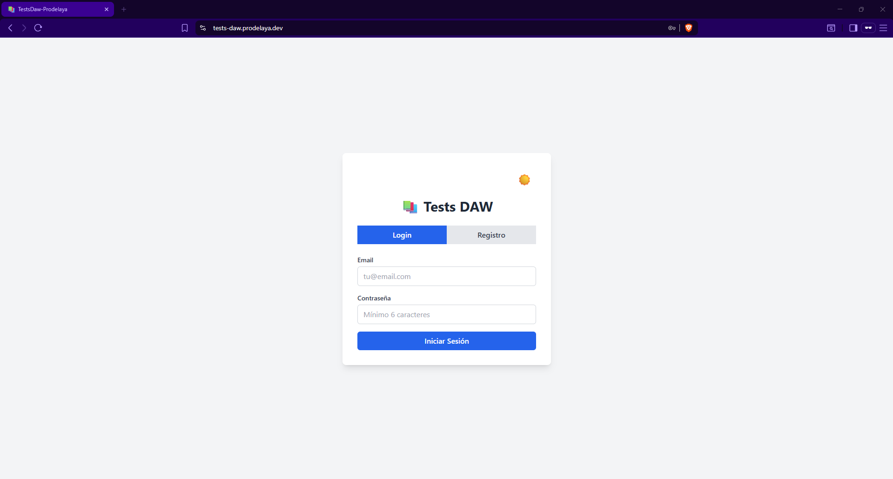
*Sistema de login/registro con toggle y validaciones frontend*

### Dashboard
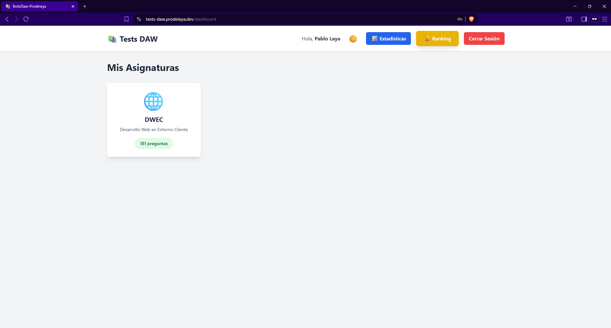
*Vista principal con todas las asignaturas y contadores dinámicos*

### Detalle de Asignatura
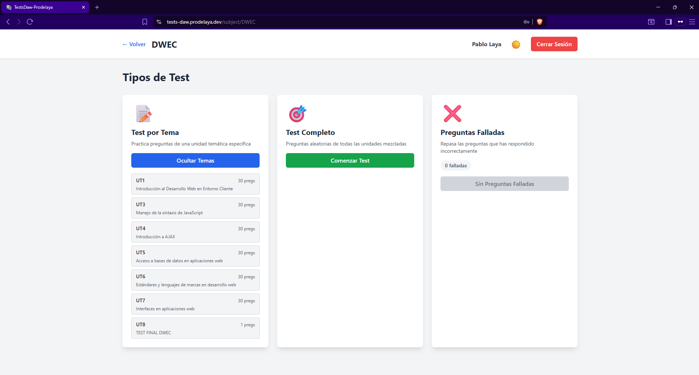
*3 tipos de test: por tema, completo, y preguntas falladas*

### Configuración de Test
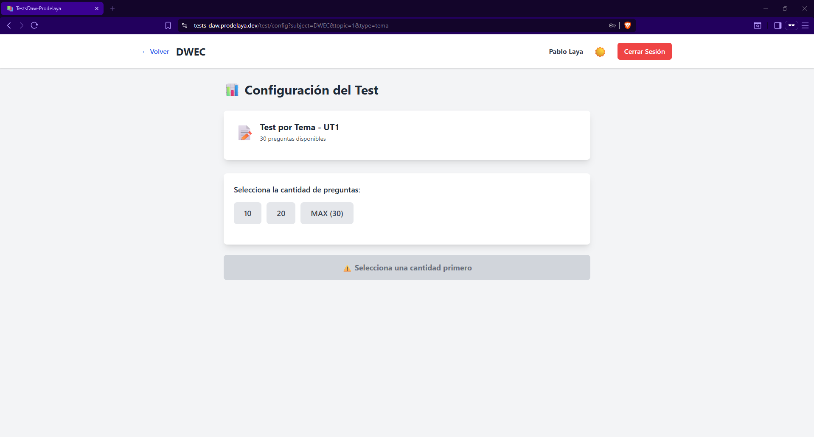
*Selector dinámico de cantidad de preguntas*

### Modo Práctica
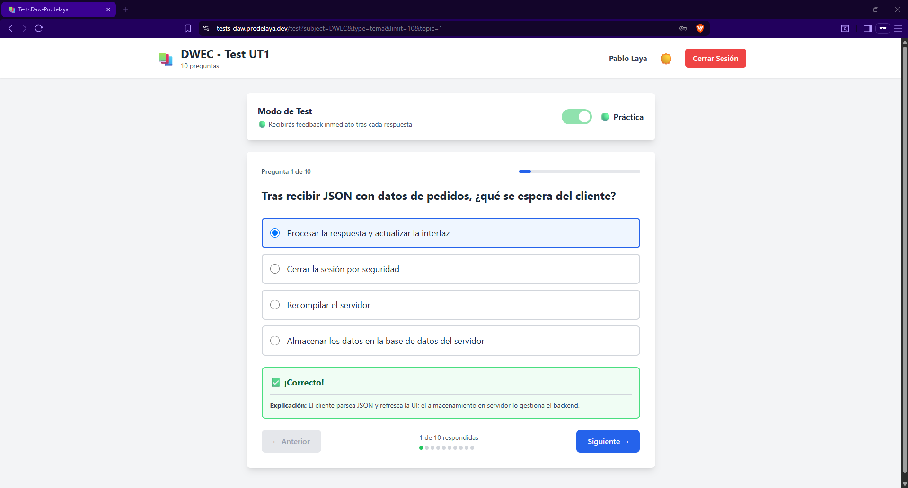
*Feedback inmediato con explicaciones (modo aprendizaje)*

### Modo Examen
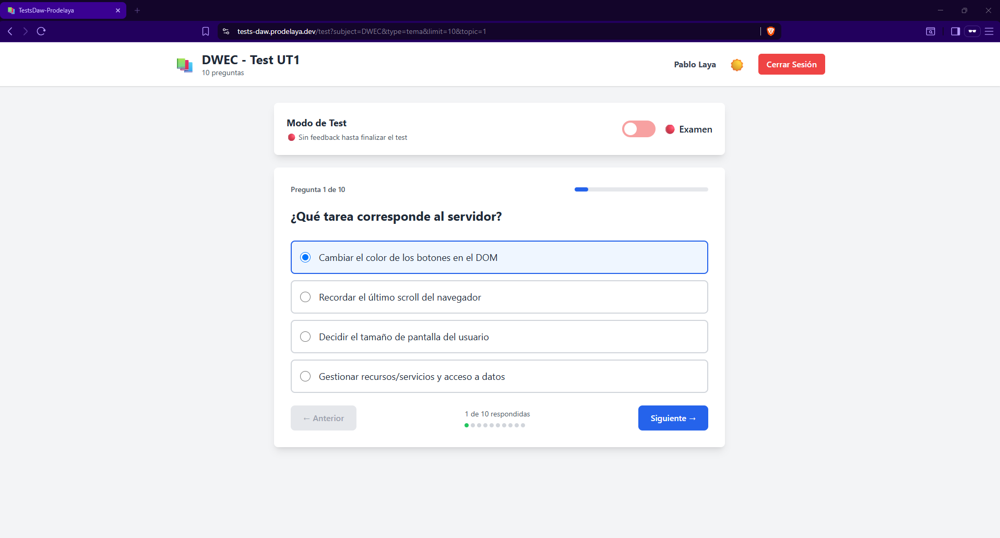
*Sin feedback durante el test (simulación real)*

### Resultados
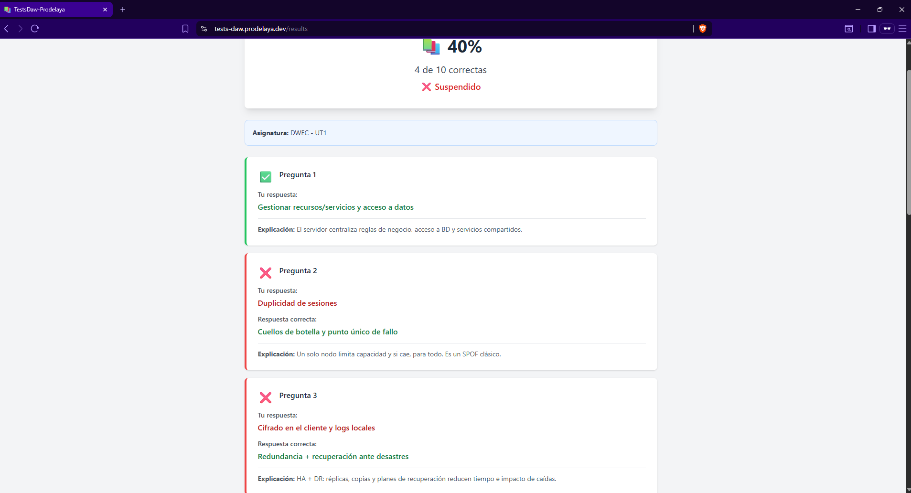
*Score detallado con correctas/incorrectas y explicaciones*

### Estadísticas
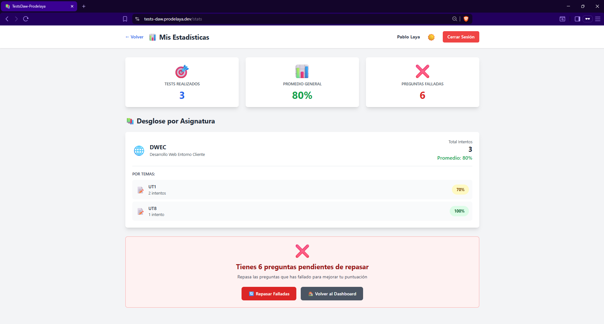
*Análisis completo por asignatura y tema con promedios*

### Ranking
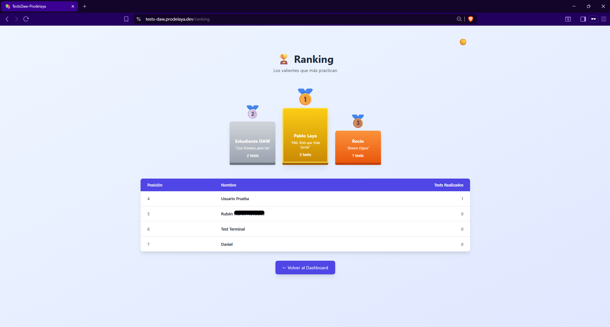
*Podio top 3 con títulos roast + tabla completa*

### Dark Mode
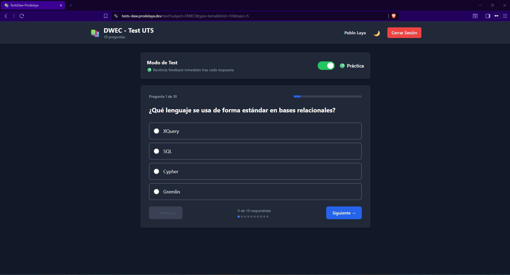
*Paleta de colores elegante con toggle en todas las páginas*

### Responsive Mobile
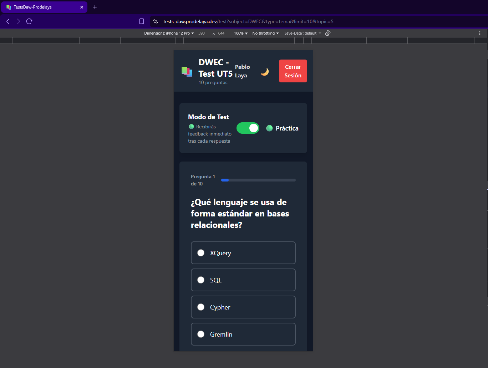
*Diseño adaptado para dispositivos móviles*

---

## 🚀 Instalación Local

### Prerrequisitos
- Node.js 20+ (LTS)
- PostgreSQL 15+
- npm o pnpm

### 1. Clonar Repositorio
```bash
git clone https://github.com/Prodelaya/proyecto-daw-tests.git
cd proyecto-daw-tests
```

### 2. Backend Setup
```bash
cd backend

# Instalar dependencias
npm install

# Configurar variables de entorno
cp .env.example .env
# Editar .env con tus credenciales PostgreSQL

# Generar cliente Prisma
npx prisma generate

# Ejecutar migraciones
npx prisma migrate dev

# Cargar datos de ejemplo (211 preguntas DWEC)
npm run seed

# Iniciar servidor (puerto 3001)
npm run dev
```

### 3. Frontend Setup
```bash
cd ../frontend

# Instalar dependencias
npm install

# Configurar variables de entorno
cp .env.example .env
# VITE_API_URL=http://localhost:3001/api

# Iniciar dev server (puerto 5173)
npm run dev
```

### 4. Acceder a la Aplicación
- **Frontend:** http://localhost:5173
- **Backend API:** http://localhost:3001/api
- **Prisma Studio:** `npx prisma studio` (puerto 5555)

---

## 📈 Escalabilidad: Añadir Asignaturas

El sistema está diseñado para crecer sin modificar código. Para añadir nuevas asignaturas:

### Estructura de Datos (JSON)

Cada asignatura se define en un archivo JSON con esta estructura:

```json
{
  "subjects": [
    {
      "subjectCode": "DWES",
      "subjectName": "Desarrollo Web Entorno Servidor",
      "topics": [
        {
          "topicNumber": 1,
          "topicTitle": "Arquitecturas y lenguajes",
          "questions": [
            {
              "text": "¿Qué es un servidor web?",
              "options": ["A", "B", "C", "D"],
              "correctAnswer": "A",
              "explanation": "Explicación detallada..."
            }
          ]
        }
      ]
    }
  ]
}
```

### Proceso de Carga

```bash
# 1. Crear archivo JSON
backend/src/seed/DWES/dwes_ut1.json

# 2. Ejecutar seed automático
cd backend
npm run seed

# 3. Verificar en Prisma Studio
npx prisma studio
```

**¡Eso es todo!** El sistema:
- ✅ Detecta la nueva asignatura automáticamente
- ✅ Crea tarjeta en Dashboard
- ✅ Genera opciones de test
- ✅ Actualiza contadores dinámicos

### Asignaturas Planeadas

El proyecto tiene estructura para 8 asignaturas DAW:
- ✅ **DWEC** - Desarrollo Web Entorno Cliente (211 preguntas)
- ⏳ **DWES** - Desarrollo Web Entorno Servidor
- ⏳ **DAW** - Despliegue de Aplicaciones Web
- ⏳ **DIW** - Diseño de Interfaces Web
- ⏳ **DASP** - Desarrollo Aplicaciones con Seguridad y Privacidad
- ⏳ **IPE** - Itinerario Personal para Empleabilidad
- ⏳ **CIBER** - Ciberseguridad
- ⏳ **SASP** - Sistemas de Administración y Servicios en la nube

**Roadmap:** Añadir 1-2 asignaturas por mes según disponibilidad de tests.

---

## 🌐 Deploy en Producción

### Arquitectura de Deploy

```
Usuario
  ↓
Cloudflare DNS (prodelaya.dev)
  ↓
├─→ tests-daw.prodelaya.dev → Vercel (Frontend)
└─→ api-tests.prodelaya.dev → Cloudflare Tunnel → Ubuntu Server (Backend)
```

### Frontend (Vercel)

**Deploy automático con GitHub:**
1. Push a `main` → Vercel detecta cambios
2. Build automático: `npm run build`
3. Deploy en CDN global (< 2 min)
4. URL: https://tests-daw.prodelaya.dev

**Variables de entorno:**
```
VITE_API_URL=https://api-tests.prodelaya.dev/api
```

### Backend (Ubuntu + PM2 + Cloudflare Tunnel)

**1. Compilar TypeScript:**
```bash
npm run build  # Genera dist/
```

**2. PM2 Process Manager:**
```bash
pm2 start dist/index.js --name api-tests
pm2 startup  # Arranque automático
pm2 save     # Guardar configuración
```

**3. Cloudflare Tunnel (Sin abrir puertos):**
```bash
cloudflared tunnel create daw-backend
cloudflared tunnel route dns daw-backend api-tests.prodelaya.dev
pm2 start cloudflared --name cloudflare-tunnel -- tunnel run daw-backend
```

**Ventajas:**
- ✅ HTTPS automático (certificado Cloudflare)
- ✅ Sin exponer IP del servidor
- ✅ DDoS protection incluido
- ✅ Sin configurar router/firewall

### Costos

| Componente | Proveedor | Costo |
|------------|-----------|-------|
| Dominio .dev | Cloudflare Registrar | 12€/año |
| Frontend Hosting | Vercel | GRATIS |
| Cloudflare Tunnel | Cloudflare | GRATIS |
| Backend Hosting | Servidor propio | 0€ |
| **TOTAL** | | **1€/mes** |

---

## 🗺️ Roadmap

### ✅ Completado (v1.0)
- [x] Sistema de autenticación JWT
- [x] CRUD completo de tests
- [x] Modo Práctica vs Modo Examen
- [x] Estadísticas detalladas
- [x] Ranking con gamificación
- [x] Dark mode completo
- [x] Deploy en producción
- [x] 211 preguntas DWEC

### 🚧 En Desarrollo (v1.1)
- [ ] 5 asignaturas más (DWES, DAW, DIW, DASP, IPE)
- [ ] Sistema de badges/logros
- [ ] Gráficos temporales de progreso
- [ ] Exportar estadísticas a PDF

### 📋 Planificado (v2.0)
- [ ] PWA (instalable en móvil)
- [ ] Notificaciones push
- [ ] Modo multiplayer (competir en tiempo real)
- [ ] Análisis de preguntas con IA (dificultad adaptativa)

---

## 📚 Documentación Técnica

Documentación detallada de implementación en:
- [Sesión 10 - TestConfig](docs/session_10.md)
- [Sesión 11 - TestView con Doble Modo](docs/session_11.md)
- [Sesión 13 - Sistema de Ranking](docs/session_13.md)
- [Sesión 15 - Deploy con Cloudflare Tunnel](docs/session_15.md)
- [Sesión 18 - Dark Mode](docs/session_18.md)

---

## 👨‍💻 Contacto

**Desarrollador:** Prodelaya  
**GitHub:** [@Prodelaya](https://github.com/Prodelaya)  


**Objetivo profesional:** Backend Developer especializado en **Python** (Django/FastAPI)

Este proyecto demuestra:
- 🎯 Arquitectura backend escalable (MVC, REST, ORM)
- 🔐 Seguridad (JWT, hashing, validación)
- ⚡ Optimización de queries (O(n) vs O(n²))
- 📊 Diseño de base de datos relacional
- 🚀 DevOps (PM2, Cloudflare Tunnel, CI/CD)

**Habilidades transferibles a cualquier stack backend (Python, Java, Go, Rust).**

---

## 📄 Licencia

Este proyecto es de código abierto bajo licencia MIT.

---

## 🙏 Agradecimientos

- **Cloudflare** - Túnel y DNS gratuito
- **Vercel** - Hosting frontend
- **Prisma** - ORM type-safe excelente
- **Tailwind CSS** - Diseño responsive eficiente

---

<div align="center">

**⭐ Si este proyecto te resulta útil, considera darle una estrella en GitHub**

[](https://github.com/Prodelaya/proyecto-daw-tests)

</div>
